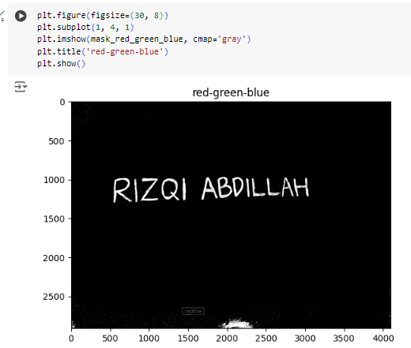

# Project UTS Pengolahan Citra Digital

## Gambar

## Rincian

# 1. DETEKSI WARNA PADA CITRA
- Pertama kita import library seperti code dibawah ini :
import cv2 import numpy as np import matplotlib.pyplot as plt

- Kode tersebut mengimpor tiga pustaka yang berbeda:
1. cv2: OpenCV untuk pemrosesan citra.
2. matplotlib.pyplot as plt: Matplotlib untuk membuat plot dan grafik.
3. numpy as np: NumPy untuk komputasi numerik.

Kemudian membaca data gambar dengan code dibawah ini : 
img = cv2.imread('IMG_20240510_104833.jpg') img_rgb = cv2.cvtColor(img, cv2.COLOR_BGR2RGB) hsv_img = cv2.cvtColor(img, cv2.COLOR_BGR2HSV)

- Coding tersebut bertujuan untuk membaca file gambar "IMG_20240510_104833.jpg" dan menyimpannya dalam variabel img menggunakan OpenCV.

- cv2.cvtColor(img, cv2.COLOR_BGR2RGB) : Ini adalah fungsi yang digunakan untuk mengubah ruang warna gambar. Dalam hal ini, gambar yang dibaca sebelumnya (img) dikonversi dari format BGR (Blue-Green-Red) ke format RGB (Red-Green-Blue). Karena OpenCV membaca gambar dalam format BGR secara default, tetapi dalam banyak kasus, kita lebih suka menggunakan format RGB.

- cv2.cvtColor(img, cv2.COLOR_BGR2HSV) : fungsi yang sama untuk mengubah ruang warna, tetapi kali ini mengonversi dari BGR ke HSV (Hue-Saturation-Value). HSV adalah model warna yang sangat berguna dalam pengolahan citra, terutama untuk deteksi warna, karena memisahkan informasi warna (hue), kejenuhan (saturation), dan nilai (value/brightness).

- Kemudian mendefinisikan warna dari semua warna

- Deklarasikan warna yang akan digunakan

## Menampilkan gambar dan hasil deteksi warna

- kode menampilkan gambar original :

## Penjelasan
plt.figure(figsize=(30, 8)) : Membuat sebuah figure baru untuk menampung plot. figsize=(30, 8) menentukan ukuran figure dalam satuan inch. Ukuran tersebut adalah 30x8 inch.

plt.subplot(1, 4, 1) : Menentukan bahwa kita akan memiliki grid plot 1 baris dan 4 kolom, dan kita akan memplot pada subplot ke-1.

plt.imshow(img_rgb): Menampilkan gambar img_rgb di subplot yang telah ditentukan sebelumnya.

plt.title('Original Image') : Memberikan judul pada plot, dalam hal ini "Original Image".

plt.axis('off'): Ini menghilangkan sumbu x dan y pada plot.

plt.show(): Ini menampilkan plot yang telah dibuat.

## Deteksi Warna Biru/Blue

- kode menampilkan gambar deteksi warna biru :

## Penjelasan

plt.figure(figsize=(30, 8)) : Membuat sebuah figure baru dengan ukuran 30x8 inch.

plt.subplot(1, 4, 2) : Menentukan bahwa kita akan memiliki grid plot 1 baris dan 4 kolom, dan kita akan memplot pada subplot ke-2.

plt.imshow(mask_blue_inv, cmap='gray') : Menampilkan gambar mask_blue_inv di subplot yang telah ditentukan sebelumnya. Bedanya, cmap='gray' mengatur colormap menjadi grayscale, yang berarti gambar akan ditampilkan dalam skala keabuan.

plt.title('Deteksi Warna Blue'): Memberikan judul pada plot, kali ini judulnya adalah "Deteksi Warna Blue".

plt.axis('off'): Menghilangkan sumbu x dan y pada plot, sama seperti sebelumnya.

plt.show(): Menampilkan plot yang telah dibuat.

## Deteksi Warna Merah/Red

- kode menampilkan gambar deteksi warna merah :

## Penjelasan

plt.figure(figsize=(30, 8)) : Membuat sebuah figure baru dengan ukuran 30x8 inch, seperti sebelumnya.

plt.subplot(1, 4, 3) : Menentukan subplot ke-3 dalam grid plot 1 baris dan 4 kolom.

plt.imshow(mask_red_inv, cmap='gray'): Menampilkan gambar hasil deteksi warna merah, mask_red_inv, di subplot yang telah ditentukan sebelumnya. Dengan cmap='gray', gambar ditampilkan dalam skala keabuan (grayscale).

plt.title('Deteksi Warna Red') : Memberikan judul pada plot "Deteksi Warna Red".

plt.axis('off') : Menghilangkan sumbu x dan y pada plot, sama seperti sebelumnya.

plt.show() : Menampilkan plot yang telah dibuat.

## Deteksi Warna Hijau / Green

- kode menampilkan gambar deteksi warna hijau :

## Penjelasan
plt.figure(figsize=(30, 8)) : Membuat sebuah figure baru dengan ukuran 30x8 inch.

plt.subplot(1, 4, 4): Menentukan subplot ke-4 dalam grid plot 1 baris dan 4 kolom.

plt.imshow(mask_green_inv, cmap='gray') : Menampilkan gambar hasil deteksi warna hijau, mask_green_inv, di subplot yang telah ditentukan sebelumnya. Dengan cmap='gray', gambar ditampilkan dalam skala keabuan (grayscale).

plt.title('Deteksi Warna Green'): Memberikan judul pada plot, kali ini judulnya adalah "Deteksi Warna Green".

plt.axis('off'): Menghilangkan sumbu x dan y pada plot.

plt.show(): Menampilkan plot yang telah dibuat.

# 2. MENGURUTKAN AMBANG BATAS TERKECIL SAMAPAI DENGAN TERBESAR

- berikut ini ada;ah urutan ambang batas dari yang terkecil sampai yang terbesar

## None

## Blue

## Red_Blue

## Red_Green_Blue

## Hasil Nilai Ambang

- Penjelasan
hue_channel = hsv_img[:,:,0]: Ini mengambil saluran Hue (saluran pertama) dari gambar yang telah dikonversi ke ruang warna HSV.

    _, blue_thresh = cv2.threshold(hue_channel, 100, 130, cv2.THRESH_BINARY) : Menemukan ambang batas untuk warna biru dengan menggunakan thresholding pada saluran Hue. Nilai threshold yang digunakan di sini adalah 100 hingga 130.

    _, red1_thresh = cv2.threshold(hue_channel, 0, 10, cv2.THRESH_BINARY): Ini menemukan ambang batas untuk warna merah (bagian 1) dengan menggunakan thresholding pada saluran Hue. Karena rentang Hue untuk merah terletak di dekat 0 dan 180 (karena sifat lingkaran dari model warna HSV), thresholding dilakukan pada nilai 0 hingga 10.

    _, red2_thresh = cv2.threshold(hue_channel, 170, 180, cv2.THRESH_BINARY) : Menemukan ambang batas untuk warna merah (bagian 2) dengan menggunakan thresholding pada saluran Hue. Karena sifat lingkaran dari model warna HSV, nilai threshold diletakkan di antara 170 hingga 180.

    _, green_thresh = cv2.threshold(hue_channel, 40, 80, cv2.THRESH_BINARY) : Menemukan ambang batas untuk warna hijau dengan menggunakan thresholding pada saluran Hue. Rentang Hue untuk hijau biasanya berkisar antara 40 hingga 80.

    all_thresholds = np.unique(np.concatenate((blue_thresh, red1_thresh, red2_thresh, green_thresh))) : Menggabungkan semua ambang batas yang telah ditemukan untuk setiap warna, dan kemudian menghapus duplikatnya menggunakan np.unique.

    sorted_thresholds = np.sort(all_thresholds) : Mengurutkan ambang batas dari yang terkecil hingga yang terbesar.

    print("Ambang Batas Terkecil hingga Terbesar:"): Mencetak pesan untuk memberi tahu bahwa hasil berikutnya adalah ambang batas yang telah diurutkan.

    print(sorted_thresholds): Mencetak ambang batas yang telah diurutkan.

    ## Histogram

    

    ## Penjelasan
    ### cara 1
- Membuat subplot 2x2 dengan ukuran total 15x5 inci
    fig, axs = plt.subplots(2, 2, figsize=(15, 5))

- Menampilkan gambar pada subplot di baris pertama dan kolom pertama dengan colormap 'gray'
axs[0, 0].imshow(img, cmap='gray')

- Membuat histogram dari gambar yang telah diratakan (flatten) dengan 256 bins dan rentang nilai [0, 256] axs[0, 1].hist(img.ravel(), 256, [0, 256])

### cara 2
- Menghitung histogram menggunakan cv2.calcHist() untuk channel ke-0 dari gambar 'img', dengan 256 bins dan rentang nilai [0, 256] : hist = cv2.calcHist([img], [0], None, [256], [0, 256])

- Menampilkan gambar pada subplot di baris kedua dan kolom pertama dengan colormap 'gray' : axs[1, 0].imshow(img, cmap='gray')

- Membuat plot dari histogram yang telah dihitung sebelumnya : axs[1, 1].plot(hist)

- Menampilkan keseluruhan plot : plt.show()

